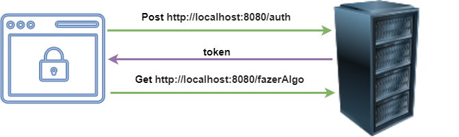

# Live sobre JWT

Em 18/06/2025 ocorreu a live sobre JWT. Nesta foram apresentados conceitos sobre segurança de aplicações web, protocolos de autenticação e JWT.

# Apresentação

O PDF da apresentação está em /docs/JWT.pdf

# Aplicação

A aplicação foi feita com SpringBoot 3.5.0, utilizando apenas o stater-web. Além disto, usa-se o Lombok e as dependencias para jwt. A versão do jJava é 21. Não foi configurado o Swagger. O Postman deve ser utilizado para testes.

# Funcionamento

Primeiro deve-se solicitar a criação do token pela url <http://localhost:8080/auth> via _HTTP Post_. No *body* devem ser passados 2 parâmetros: *cliente* com valor **XPTO** e *senha* com valor **%RDiwL@^i|{W**. Desta forma o token deve ser criado e retronado. Após isso, o mesmo deve ser configurado no Authorization, para assim ser enviado no header da quisição para a url <http://localhost:8080/fazerAlgo> via _HTTP GET_. Desta forma, uma mensagem de que o recurso foi acessado deve ser exibida. A imagem a seguir itustra este mecanismo.

